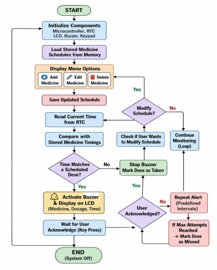
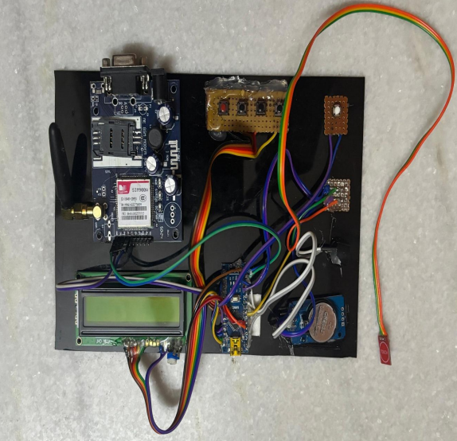

# offline-medicine-reminder-system
An IoT-based offline medicine reminder system using Arduino, RTC, LCD, and buzzer. Helps users take medicines on time without internet connectivity. Designed for elderly and rural healthcare support.

# 💊 Offline Medicine Reminder System


---

## 📌 Overview

The **Offline Medicine Reminder System** is an IoT-based embedded solution designed to help users take medicines on time without relying on internet connectivity or smartphones.
It is especially useful for **elderly patients, rural healthcare environments, and individuals with complex medication schedules**.

---

## 🚀 Features

* ⏰ Real-time medicine reminders using RTC module
* 🔔 Audio alerts using buzzer
* 📟 LCD display showing medicine details
* 🧠 Stores multiple medicine schedules locally
* 🔁 Repeated alerts if dose is not acknowledged
* 🌐 Fully offline system (no internet required)

---

## 🛠️ Tech Stack

* Embedded Systems
* IoT Concepts
* Arduino (Microcontroller)
* RTC (Real-Time Clock) Module
* LCD Display
* Buzzer

---

## 🧪 Working

1. User enters medicine schedule (time, name, dosage)
2. RTC continuously tracks current time
3. System compares real-time with stored schedules
4. When matched → buzzer alert + LCD display
5. User acknowledges → alert stops
6. If not acknowledged → alert repeats

---

## 📄 Project Report

📥 [View Full Report](./Offline-Medicine-Reminder-System-Report.pdf)

---

## 🖼️ System Flowchart



---

## 📊 Hardware Setup / Output



---

## 📁 Project Structure

```
offline-medicine-reminder-system/
│── README.md
│── LICENSE
│── Offline-Medicine-Reminder-System-Report.pdf
│── images/
│   ├── flowchart.png
│   └── output.png
```

---

## 🎯 Applications

* Elderly care systems
* Chronic disease management
* Rural healthcare solutions
* Personal medication tracking

---

## 🔮 Future Scope

* 📱 Mobile app integration
* 📩 SMS alerts to caregivers
* 💊 Smart pillbox with sensors
* 📊 Medication tracking and analytics

---

## 👩‍💻 Author

**Pranvi Reddy**

---

⭐ If you find this project useful, consider giving it a star!

